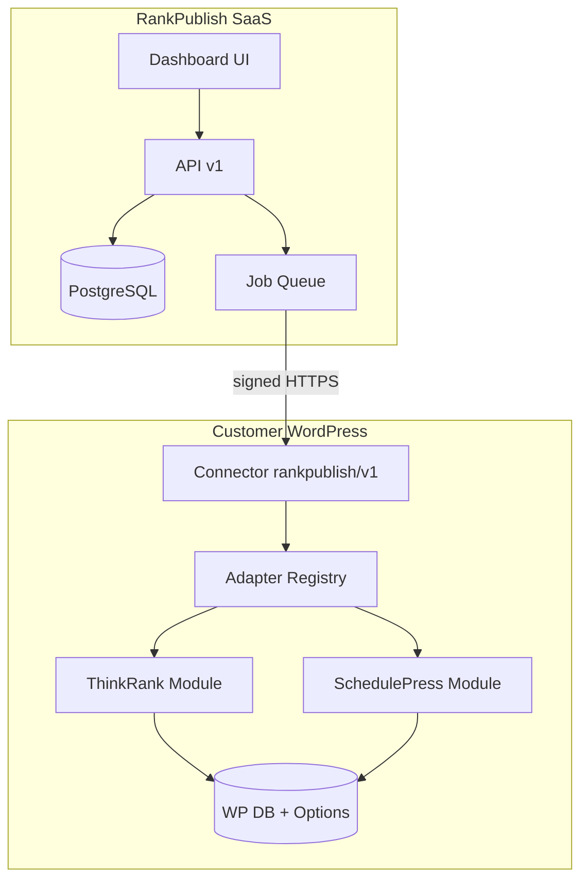
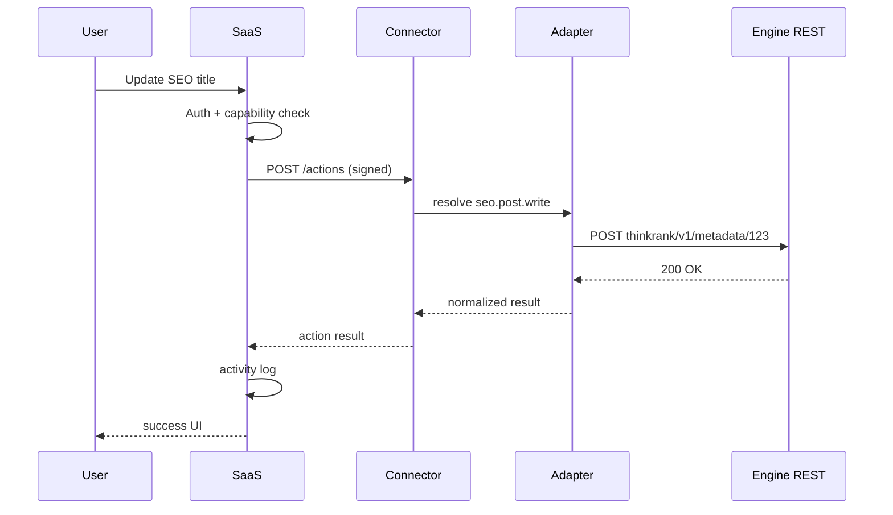

# RankPublish — Target Architecture

**Status:** Phase 0 specification (based on audit findings)  
**Date:** 2026-08-17  
**Supersedes:** Partial overlap with `rankpublish/docs/ARCHITECTURE.md` (merge-focused). This document covers **SaaS + Connector + Adapters**.

---

## 1. Architectural principles (from product spec)

1. **Plugin engines stay in WordPress** — ThinkRank and SchedulePress execute all local operations.
2. **No feature removal or simplification** — SaaS exposes full plugin capability through adapters.
3. **No rebuild from scratch** — Adapters proxy to existing REST/AJAX/hooks.
4. **No direct database access from SaaS** — All mutations go through WordPress APIs.
5. **Local-first** — Scheduling, SEO, social publish, schema, sitemap run on customer WP.
6. **Cloud for tenancy** — Account, billing, AI aggregation, rank tracking (future), activity logs.
7. **Capability-based UI** — Dashboard sections appear based on discovered integrations, not plugin names.

---

## 2. Current state vs target

```
TODAY (two disconnected stacks):

  [Nashir SaaS apps/web] ←HMAC→ [Nashir plugin apps/plugin]
                                       ↓
                                 WP posts only
                                 (no ThinkRank/SP)

  [RankPublish merged plugin LocalWP] — standalone WP admin
                                       ↓
                                 ThinkRank + SchedulePress
                                 (no SaaS connector)


TARGET:

  [RankPublish SaaS] ←signed API→ [RankPublish Connector]
                                         ↓
                                   Adapter Layer
                                    /         \
                          ThinkRankAdapter   SchedulePressAdapter
                                    \         /
                                 ThinkRank + SchedulePress
                                 (embedded or standalone)
```

---

## 3. System components

### 3.1 RankPublish SaaS (cloud)

**Base:** Evolve `nashir/apps/web` OR greenfield Next.js app.

| Module | Responsibility |
|--------|----------------|
| Auth | Users, sessions, workspace isolation |
| Billing | Subscriptions, trial, seat binding |
| Websites | Site registry, connection status |
| Integrations | Plugin registry (ThinkRank, SchedulePress, future) |
| Capabilities | Aggregated capability index per site |
| Actions | Action dispatch, job queue, idempotency |
| Activity | Audit log, error surfacing |
| Dashboard UI | Dynamic capability-based navigation |
| Post Workspace | Unified post view (content + SEO + social + schedule) |

**Does not contain:** SEO analysis algorithms, social OAuth token exchange logic, WP post storage as source of truth.

### 3.2 RankPublish Connector (WordPress plugin)

**Base options:**

| Option | Description |
|--------|-------------|
| **A. Extend merged RankPublish plugin** | Add `includes/connector/` to existing v0.8.0 plugin |
| **B. Thin standalone connector** | Separate plugin requires RankPublish engines present |
| **C. Evolve Nashir plugin** | Replace `nashir/v1` post-only API with adapter router |

**Recommended:** Option A — customer installs one plugin; connector coexists with embedded modules.

| Connector responsibility | Detail |
|--------------------------|--------|
| Handshake | Pairing token exchange with SaaS |
| Authentication | Verify signed inbound requests from SaaS |
| Discovery | Report installed integrations + versions + capabilities |
| Action router | Map `action_id` → adapter method |
| Job runner | Long-running actions (bulk share, analysis) |
| Heartbeat | Site health, version sync |
| Error envelope | Normalize WP/REST errors for SaaS |

**New REST namespace (proposed):** `rankpublish/v1`

Does not replace `thinkrank/v1` or `wp-scheduled-posts/v1` — wraps them internally.

### 3.3 Adapter layer (inside Connector)

```
RankPublish\Integrations\
├── IntegrationInterface.php
├── Registry.php
├── ThinkRank\
│   ├── Adapter.php
│   ├── Capabilities.php
│   └── Actions\*.php
└── SchedulePress\
    ├── Adapter.php
    ├── Capabilities.php
    └── Actions\*.php
```

Each adapter:
- Declares `integration_id`, `version`, `required_engine_version`
- Maps RankPublish capability IDs → engine REST calls
- Translates request/response shapes to RankPublish action envelope
- Never imports engine internals directly unless REST insufficient (last resort: documented WP hooks)

### 3.4 Plugin engines (unchanged)

| Engine | Distribution |
|--------|----------------|
| ThinkRank + Pro | Embedded in RankPublish `modules/seo*` |
| SchedulePress + Pro | Embedded in RankPublish `modules/schedule*` |

Standalone upstream plugins remain supported on dev stack for merge workflow; production customers get merged plugin only.

---

## 4. Request flow

### 4.1 Action execution

```
User → SaaS UI
     → POST /api/v1/sites/{id}/actions
         { action: "seo.post.update", post_id: 123, payload: {...}, idempotency_key: "..." }
     → SaaS validates: user → workspace → site → subscription → capability
     → SaaS signs request to site
     → POST https://customer.site/wp-json/rankpublish/v1/actions
     → Connector verifies signature
     → Registry resolves action → ThinkRankAdapter::updatePostSeo()
     → Internal: wp_remote_request to /wp-json/thinkrank/v1/metadata/123
     → Response normalized → SaaS → UI
     → Activity log entry
```

### 4.2 Capability discovery (on connect + periodic)

```
Connector → foreach registered adapter:
              adapter.getCapabilities()
            → merge + deduplicate
            → POST to SaaS /api/v1/sites/{id}/capabilities
SaaS stores snapshot → drives dashboard nav
```

ThinkRank already exposes `GET thinkrank/v1/capabilities` — adapter can wrap or extend.

### 4.3 Post sync (read path)

```
SaaS → Connector: actions/posts.list, actions/posts.get
Connector → WP_Query + adapter enrichment (SEO meta, schedule, social)
         → Return unified post DTO (RankPublish schema, not raw WP)
```

On-demand fetch preferred over full mirror; Nashir `EditorialPost` model evolves to cache + pointers.

---

## 5. Data architecture

### 5.1 SaaS database (PostgreSQL)

**Keep from Nashir Prisma schema:**
- `User`, `Workspace`, `Site`, `PairingCode`, `Subscription`
- `EditorialPost` (cache), `ScheduleJob` (evolve to generic `ActionJob`)

**Add:**

| Model | Purpose |
|-------|---------|
| `SiteIntegration` | `{ siteId, integrationId, version, status }` |
| `SiteCapability` | `{ siteId, capabilityId, enabled, source }` |
| `ActionLog` | `{ id, siteId, action, status, idempotencyKey, payload, result, error }` |
| `ActivityEvent` | User-facing activity feed |
| `SyncState` | Last capability sync, last post sync cursor |

**Do not store:** Full SEO tables, social OAuth secrets (stay on WP), ThinkRank AI cache.

### 5.2 WordPress (customer site)

Source of truth for:
- Posts, pages, CPTs
- ThinkRank tables (`thinkrank_*`)
- SchedulePress options (`wpsp_*`, `wpscp_*`)
- Social OAuth tokens
- Connector credentials (`rankpublish_site_id`, `rankpublish_signing_secret`)

---

## 6. Multi-tenancy & authorization chain

Every SaaS request validates:

```
Authenticated User
  → Workspace membership
  → Site ownership (workspaceId match)
  → Subscription live (trial/active/manual)
  → Capability enabled on site
  → Action permitted for capability
```

Connector validates:

```
Signed request from SaaS (HMAC + timestamp + replay window)
  → Site ID match
  → Action exists in registry
  → Engine available + version compatible
```

Reuse Nashir crypto pattern (`apps/plugin/includes/class-crypto.php`, `apps/web/src/lib/crypto.ts`).

---

## 7. UI architecture

### 7.1 Dynamic navigation

```typescript
type NavSection = {
  id: string;           // "seo", "social", "schedule"
  label: string;        // User-facing, no plugin names
  capabilities: string[];
  children?: NavSection[];
};

// Built from SiteCapability[] — not hardcoded routes
```

### 7.2 Post Workspace (MVP milestone 5)

Single view composing adapters:

| Panel | Source adapter | Engine |
|-------|----------------|--------|
| Content | Core WP | WordPress |
| SEO | ThinkRankAdapter | ThinkRank |
| Social publish | SchedulePressAdapter | SchedulePress |
| Schedule | SchedulePressAdapter | SchedulePress |
| Analytics | ThinkRankAdapter | ThinkRank (read) |

### 7.3 Branding

User sees **RankPublish** everywhere. Plugin names hidden unless admin diagnostics.

---

## 8. Deployment topology

| Environment | SaaS (accounts) | WordPress |
|-------------|-----------------|-----------|
| **Staging live** | https://nashir.satest.top | rankpublish-test.local (customer sim) |
| **Local dev** | same staging URL for pairing | https://rankpublish.local (upstream stack) |
| **Production** | https://rankpublish.com (target) | customer domains |

> **Note:** `127.0.0.1:3000` is the Node process on the server during development/deploy only. Users and WordPress pairing must use the public SaaS URL (`nashir.satest.top` until RankPublish.com).

Deploy scripts exist: `deploy/contabo/deploy-rankpublish.cjs`, `deploy/local/qa-rankpublish.cjs`

---

## 9. Version compatibility matrix

| Layer | Current | Tracked in |
|-------|---------|------------|
| Connector | **TBD** (not built) | `rankpublish/v1/health` |
| RankPublish plugin | 0.8.0 | `RANKPUBLISH_VERSION` |
| ThinkRank embedded | 1.31.0 | `THINKRANK_VERSION` |
| ThinkRank Pro | 2.0.2 | `THINKRANK_PRO_VERSION` |
| SchedulePress | 5.3.3 | `WPSP_VERSION` |
| SchedulePress Pro | 5.3.2 | `WPSP_PRO_VERSION` |
| SaaS API | v1 (Nashir) | `/api/v1/*` |

Incompatible versions → structured error: `{ code: "INTEGRATION_VERSION_MISMATCH", integration, required, actual }`

---

## 10. Relationship to Nashir / PublisherWP

| Nashir component | RankPublish disposition |
|------------------|---------------------------|
| `apps/web` pairing/billing/calendar | **Reuse** — evolve to capability model |
| `apps/plugin` `nashir/v1` REST | **Replace** with `rankpublish/v1` action router OR deprecate overlapping routes |
| `EditorialPost` + `ScheduleJob` | **Evolve** to generic action/job models |
| SocialAccount in Prisma | **Reevaluate** — SP stores tokens on WP; SaaS may only store connection status |
| Brand PublisherWP | **Rebrand** to RankPublish |

RankPublish merged plugin docs previously said not to reuse Nashir web until requested — **now requested**.

---

## 11. Product context & licensing (confirmed 2026-08-17)

This phase is **internal product development**, not a commercial launch:

- Reuse the **GPL core** already embedded in SchedulePress and ThinkRank modules.
- Redevelop as **RankPublish** (unified product + SaaS shell) instead of rewriting SEO/scheduling from scratch.
- End users buy **RankPublish SaaS**, not standalone ThinkRank/SchedulePress licenses.
- Plugin engines stay on the customer's WordPress; RankPublish cloud is the control plane.

**Not in scope now:** public commercial distribution, multi-customer production billing, or reselling upstream plugins.

Attribution and GPL notices remain in merged modules (`rankpublish/docs/LEGAL.md`). Revisit licensing before any **public paid launch** — not a blocker for LocalWP + staging development.

---

## 12. Locked decisions (2026-08-17)

| # | Decision | Choice | Notes |
|---|----------|--------|-------|
| 1 | Plugin distribution | **RankPublish merged plugin 0.8.0** | ThinkRank + SchedulePress embedded; Account stub today |
| 2 | SaaS codebase | **Evolve Nashir web** (`apps/web`) | Pairing, billing, calendar patterns reused |
| 3 | Connector placement | **Inside merged plugin** | `rankpublish/includes/connector/` — not a separate plugin |
| 4 | Adapter → engine auth | **Internal REST + service user** | See §12.1 — not Application Password |
| 5 | Source of truth repo | **LocalWP + live staging** | Plugin not in git yet; staging via `deploy/contabo/` |
| 6 | Nashir WP plugin | **Deprecate for RankPublish sites** | `apps/plugin` patterns reused in connector; not installed alongside merged plugin |

### 12.1 Adapter → engine authentication (recommended)

Because ThinkRank and SchedulePress run **in the same PHP process** as the Connector (merged plugin), external HTTP auth is unnecessary.

**Use: internal REST dispatch + dedicated WP service user**

```
SaaS ──HMAC──► rankpublish/v1/actions     ← only external boundary
                    │
                    ▼
              wp_set_current_user( service_user_id )
                    │
                    ▼
              rest_do_request( GET/POST thinkrank/v1/... )
              rest_do_request( GET/POST wp-scheduled-posts/v1/... )
                    │
                    ▼
              wp_set_current_user( previous )   ← restore
```

| Approach | Verdict | Why |
|----------|---------|-----|
| **Internal REST + service user** | **Recommended** | Engine permission callbacks (`thinkrank_access`, `edit_post`) still run; all hooks/filters/caches fire; no HTTP loopback; no extra secrets |
| Application Password | Skip for merged plugin | Designed for **external** HTTP clients; adds rotation overhead with no benefit in-process |
| Direct PHP (skip REST) | Fallback only | Faster for hot paths, but bypasses REST validation — use when no REST route exists |

**Service user setup (on connector activation):**

1. Create WP user `rankpublish-connector` (role: custom or administrator during dev).
2. Grant: `thinkrank_access`, `thinkrank_settings`, `edit_posts`, `edit_pages`, `manage_options` (trim in hardening phase).
3. Store user ID in option `rankpublish_service_user_id`.
4. Connector sets this user before every adapter → engine call.

**Why not Application Password?** App passwords authenticate **HTTP requests to wp-json from outside WordPress**. Your adapters call engines **inside** the same request — switching `current_user` is the WordPress-native equivalent.

**Dev shortcut:** On LocalWP/staging, temporarily use user ID `1` (admin) until service user automation ships.

---

## 13. Development environments

| Environment | WordPress | SaaS | Purpose |
|-------------|-----------|------|---------|
| `rankpublish.local` | Dev stack (upstream + merged) | `localhost:3000` | Merge development |
| `rankpublish-test.local` | Product-only (rankpublish 0.8.0) | `localhost:3000` | QA (`deploy/local/qa-rankpublish.cjs`) |
| `nashir.satest.top` | Staging WP (experimental) | Same host / Contabo | Pre-production |

Credentials: SSH/env vars in `deploy/contabo/` — never committed. Use `$env:NASHIR_SSH_*` for deploy scripts.

---

## 14. Non-goals (Phase 0–MVP)

- Rebuilding ThinkRank SEO analyzer in cloud
- Replacing SchedulePress social OAuth middleware
- Selling standalone ThinkRank/SchedulePress licenses to end users
- Full offline SaaS mode without connected WP site

---

## 15. Remaining open items

| # | Item | Default |
|---|------|---------|
| 1 | Trial length | Align `TRIAL_DAYS` to 7 when billing phase starts |
| 2 | Plugin in git monorepo | Optional — LocalWP remains source until copy workflow defined |
| 3 | Service user cap trimming | Start permissive on staging; least-privilege before public launch |

---

## 16. Reference diagrams

### Component diagram



### Action lifecycle


